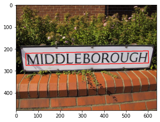
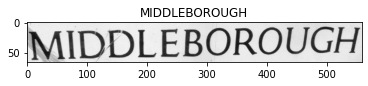

# OCR-PIPELINE
- Text Detection + Recognition으로 구성된 기본 OCR Pipeline
  - Text Detection : [CRAFT](https://github.com/clovaai/CRAFT-pytorch), [PAN](https://github.com/WenmuZhou/PAN.pytorch)으로 구성하였으며 각각 공개된 Open Source를 참고
  - Text Recognition의 경우 해당 [STR Framework](https://github.com/clovaai/deep-text-recognition-benchmark)를 참조하여 구현 
  - [PAN Review](https://github.com/jingwanha/paper-reviews/tree/main/OCR/Text%20Detection/PAN), [CRAFT Review](https://github.com/jingwanha/paper-reviews/tree/main/OCR/Text%20Detection/CRAFT), [STR Framework Review](https://github.com/jingwanha/paper-reviews/tree/main/OCR/Text%20Recognition/CLOVA)
  

  

## Requirements
- torch : 1.7.1 version
- torchvision : 0.8.2 version

 

## 실행 방법
- Text Detection pretrained 모델 다운로드
  - [CRAFT](https://drive.google.com/file/d/1Jk4eGD7crsqCCg9C9VjCLkMN3ze8kutZ/view)
  - [PAN](https://drive.google.com/drive/folders/1bKPQEEOJ5kgSSRMpnDB8HIRecnD_s4bR)
- [Text Recognition pretrained 모델 다운로드](https://drive.google.com/drive/folders/15WPsuPJDCzhp2SvYZLRj8mAlT3zmoAMW)
- 각각 모델 다운로드 후 'pipeline.ipynb' 내 'pipeline_config'내에 모델 저장 경로 지정
- 자세한 실험 방법은 pipeline.ipynb 내 주석 참고

 

## 결과 예시

